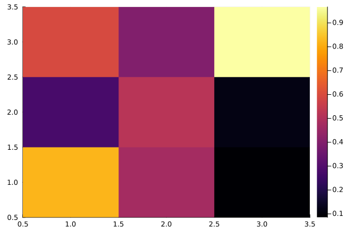

````julia
using Random
using Plots

"""
    save_array(name, A)

saves array A to location name.bin
"""
function save_array(Aname,A)
    fname = string(Aname, ".bin")
    out = open(fname, "w"); write(out, A); close(out)
end

"""
    load_array(name, A)

loads an array A from location name.bin
"""
function load_array(Aname, A)
    fname = string(Aname, ".bin")
    fid=open(fname, "r"); read!(fid, A); close(fid)
end


function main()
    A = rand(3, 3)
    B = zeros(3, 3)

    save_array("array", A)
    load_array("array", B)

    return B
end
````

````
main (generic function with 1 method)
````

Grenerate random 3x3 matrix and plot it

````julia
B = main()
heatmap(B)
````


