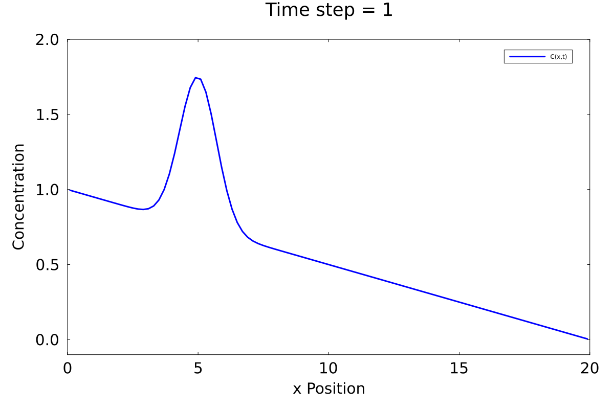
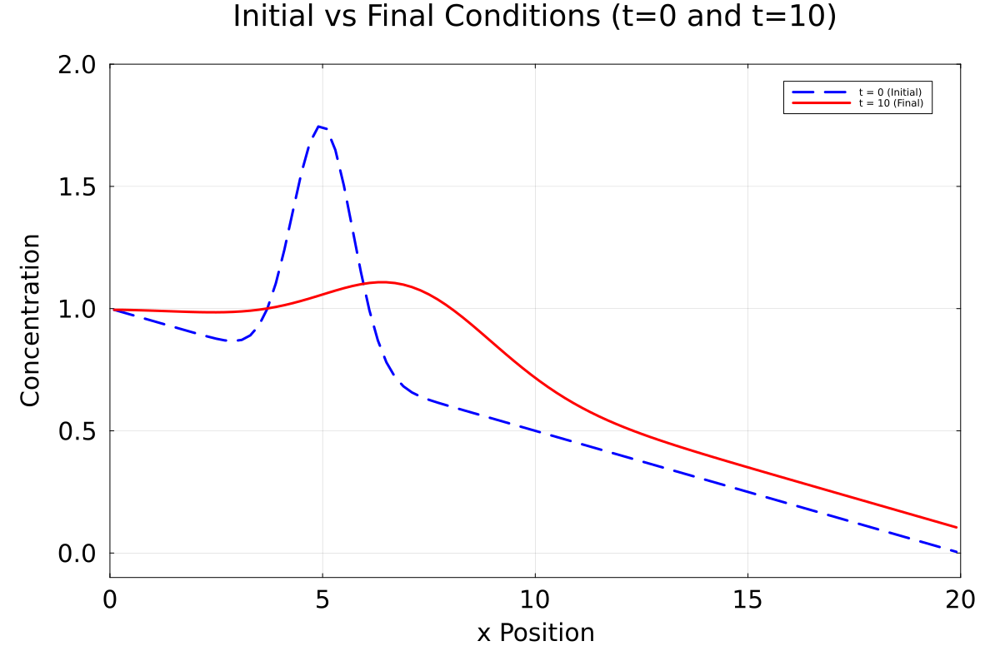

All plots and animations which not explicitly asked to put in the README are still saved in this folder. 
I plotted the error of the iterative loop only for the last timestep, but there is nearly no difference to the error plots of the other time steps and to not obtain 10 similar plots of the error I only included one here.

Exercise 1:

 

 Here the diffusion equation is solved implicitly instead of explicitly.
 For the implicit solution we do not simply invert the tridiagonal matrix describing our problem, instead an iterative scheme is used.
 A pseudo time $\tau$ is introduced, and we discretize the pseudo time and solve for the next pseudo-timestep ($c^{k+1}$) until we reach a steady state. 
 $$\frac{dc}{d\tau} \approx \frac{c^{k+1}-c^k}{d\tau}= - \frac{dc}{dt} + \frac{d^2 c}{dx^2}$$
If we reach a steady state $\frac{dc}{d\tau} = 0$ we solve exactly our original diffusion equation.
If we even reach a steady state by solving for $c^{k+1}$ is not very trivial. It can be shown if we interpret the pseudo-time equation as a diffusion equation with damping or if we use fourier analysis. It would be very interesting to analyze if this solving method will converge for other PDEs as well.

Exercise2:

Compared to the exercise of last week we can now choose our time step freely to avoid numerical diffusion in the transport equation. Due to the implicit solve we have no restrictions anymore to the maximum step size of the diffusion part.

Exercise 3:

In this exercise we investigate different pseudo-time step sizes. We can observe that there are different amounts of iterations needed depending on the size of $\tau$ and $\rho$. We can see that we can go down to around 6 iterations per cell, which is very efficient. If we would not use the implicit solve but solve the linear system with inverting the n by n matrix, where n is the number of cells in x direction, we would have a cost of $n^3$ (probably a bit less, because the matrix is sparse and tridiagonal) where we now only have a cost of $6n$, which is fantastic (I checked this for different n and it is always around 6 so it does not grow or decrease significantly for different n). 