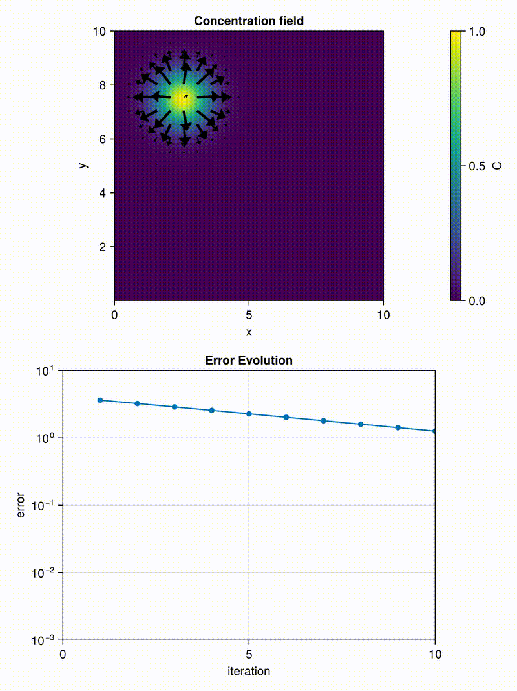

**Exercise 1:**

 
In this exercise, we solve the two-dimensional advection–diffusion equation.
We observe the same qualitative behavior as in Exercise 3, but now extended to two spatial dimensions.
During each implicit iteration, the numerical error decreases steadily. This shown a convergent solver. Interestigly the error curve also shrinks with each time iteration. This can be explained with looking at the error.

$$\text{err} = \frac{C^{n+1} - C^n}{\Delta t} - D \nabla^{2}C^{n+1}$$

Because we have diffusion, the gradients smooth out over time and $C^{n+1} - C^n$ will get smaller as the system evolves. So not only does the error decrease within each implicit iteration, but it also decreases across time steps.

**Exercise 2:**

In this part, we visualize the time evolution of the concentration field using Makie.jl.
The heatmap shows the concentration distribution, while the arrows represent the local flux direction and magnitude.
To make the arrows visible and prevent clutter, we interpolate the flux field and plot only every tenth grid point.
The resulting animation matches the task description, but using a different colormap.