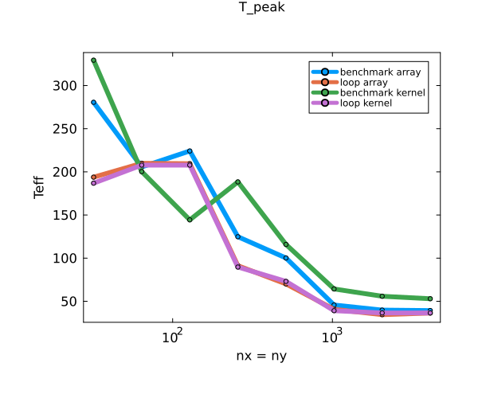

### Exercise 2

### Task 2




We can see that not only the array vs the kernel change the speed but also the way it is measured.
Interestingly when no benchmark tool is used we can hardly see a difference between the array and kernel implementation.


### Task 3


Here we tested the different diffusion implementations.

The original  line is the naive implementation.

The "perf" line uses precomputed divisions, 

the "loop" uses an explicit loop and does not check if an array is inbounds.

The "loop with threads" uses additional threads, otherwise it is the same as the "loop" implementation.

I can be observed, that the precomputation of divisions is only for small sizes effective. 
The loop implementation has a much better memory throughput, but I found out this is because of the @inboudns check.
Here we can see an other plot, where I did not use @inbounds, which changed the size significantly:

Additionally we have seen in Task 2, 
that the benchmark and the loop timing can differ, 
and in the loop and loopwiththreads implementations 
benchmark tools are used to time the program instead of the loopdivided by iterations.
The threads are an interesting observation. 
They have a clear optimal performance. I assume that this amount is such that every thread can operate on their own place in memory 
and no memory sharing is needed, so they do not(or very little) need to exchange memory between each other.

### Exercise 3

```
Test Summary: | Pass  Total  Time 
test entries  |    4      4  1.3s
```
