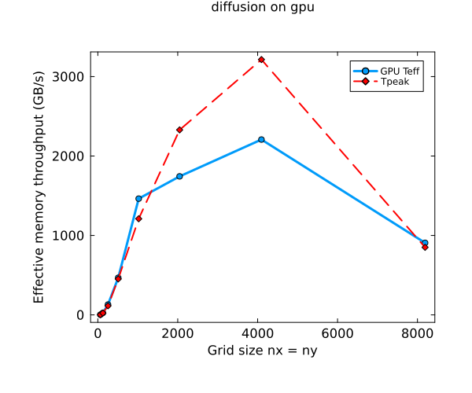

Exercise 1:  See lecture7_ex1.ipynb
Value from Task 7
My diffusion solver reaches about 32 % of the GPU’s peak memory bandwidth, meaning it performs well but could, in theory, be up to ~3× faster if memory access were perfectly optimized.

Exercise 2:

Task2
The maximal error from the gpu and cpu calculation was 8.326672684688674e-17, which is machine precision 

Task3
With the triad benchmark i computed T_peak = 3463.2643599564567 for a size of nx = ny = 16384

Task4

It can be observed, that my T_eff is for some array sizes above the peak Memory throughput.
This is unexpected ...
We can see That the best performance is reached at nx = 4096. 

Exercise 3:
I only tested for equillibrium, where the solution should be 1 everywhere. I hope this is correct. For reaching equillibrium I needed to adjust nt and let it run for a bit longer. I do not have any other reference solution so i hope this is correct.