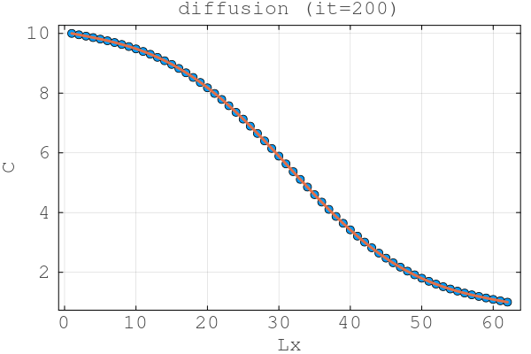
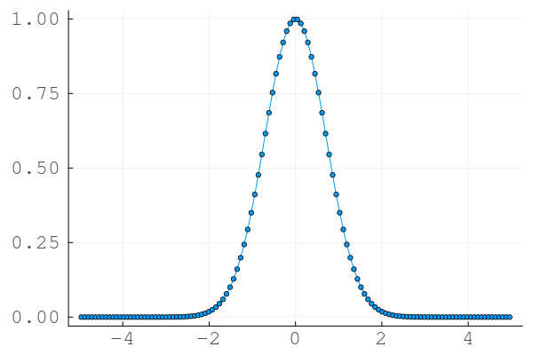
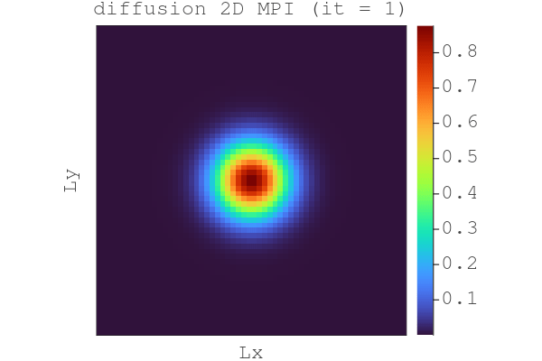

 
 Task 1.
 
 
  

 One can see how the processors communicate correctly with each other.

  Task 2.

This is the 2D diffusion with 4 processors communicating with MPI.
This command was used to run the code, becasue we need to launch MPI inside of the mpiexecjl 
~/.julia/bin/mpiexecjl -n 4 julia --project l9_diffusion_2D_mpi.jl